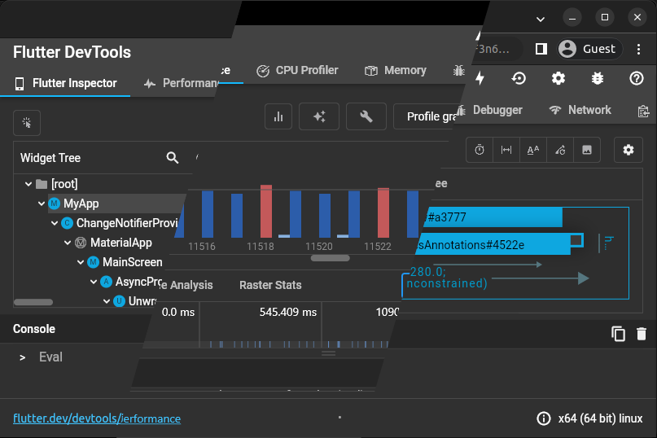

## Flutter Devtools Native Binaries

  

This project aims to compile and export [Flutter Devtools](https://docs.flutter.dev/development/tools/devtools/overview) in native platforms, bor a better performance and experience. It uses Github Actions for a more transparent compilation.

## Last Release

Check Latest release [here](https://github.com/BrianCraig/flutter-devtools-binary/releases/latest)
